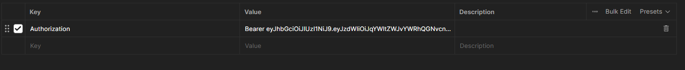

# 📌 Abitmedia - Gestión de Tareas

Este es el desarrollo de la **prueba técnica** de una aplicación backend construida con **Spring Boot (Java 21)**.  
Permite a los usuarios crear, consultar, actualizar y eliminar tareas, gestionando usuarios con autenticación basada en **JWT**.

---

## 🚀 Tecnologías usadas

- Java 21
- Spring Boot
- PostgreSQL
- Docker & Docker Compose
- Spring Security + JWT

---

## 📦 Cómo levantar el proyecto con Docker Compose

Para levantar el proyecto se requiere que **Docker** y **Docker Compose** estén previamente instalados.

### Pasos:

1️⃣ **Dirigirse a la carpeta del proyecto**  
Abrir una terminal y navegar hasta la carpeta `execute`, donde se encuentra el archivo `docker-file-execute.yaml`.

2️⃣ **Levantar los contenedores**  
Ejecutar el siguiente comando para iniciar la aplicación junto con su base de datos:

docker compose -f docker-file-execute.yaml up -d

> Esto creará un contenedor de Docker con la aplicación y su respectiva base de datos.

3️⃣ **Comprobar los endpoints**  
Dentro de la carpeta `execute` se encuentra una colección de Postman:
- Importar la colección en Postman.
- Ejecutar las peticiones para verificar que los endpoints funcionan correctamente.

---

## 🌍 Endpoints principales

| Método | Endpoint              | Descripción              | Autentificación |
|--------|-----------------------|--------------------------|-----------------|
| POST   | `/auth/usuario/login` | Autenticación de usuario | Sí              |
| POST   | `/auth/usuario/save`  | Creación del usuario     | Sí              |
| POST   | `/tareas/save`        | Crear una tarea          | No              |
| PUT    | `/tareas/update`      | Actualizar una tarea     | No              |
| GET    | `/tareas/getAll`      | Listar tareas            | No              |
| DELETE | `/tareas/delete`      | Eliminar tarea           | No              |

## 🔑 Cómo usar los endpoints que requieren autorización

Para poder utilizar los endpoints que necesitan autorización, es necesario obtener un **token de acceso**. Esto se logra iniciando sesión en la aplicación.

> Previamente se deberá crear un usuario en la aplicación.

### Pasos:

1️⃣ **Iniciar sesión en la aplicación**  
Para generar el token, primero se debe hacer una solicitud al endpoint de login:

`POST /auth/usuario/login`

- Proporcionar las credenciales del usuario (correo y contraseña).
- La respuesta incluirá un **token JWT** que será utilizado para autenticar las demás solicitudes.

2️⃣ **Copiar el token generado**  
El token recibido debe ser copiado tal cual, ya que se incluirá en las cabeceras de las solicitudes a los endpoints protegidos.

3️⃣ **Incluir el token en los headers**  
Para realizar peticiones a los endpoints que requieren autorización:
- Abrir Postman o cualquier cliente de API.
- En los headers de la solicitud, agregar:

| Key           | Value          |
|---------------|----------------|
| Authorization | Bearer `<token>` |

> Reemplazar `<token>` por el token obtenido en el paso 1 teniendo en cuenta que hay que dejar un espacio entre la palabra Bearer y el token.

- Ejemplo en Postman

4️⃣ **Ejecutar las peticiones**  
Con el token incluido en el header, se podrán probar los endpoints protegidos y obtener las respuestas correspondientes.

